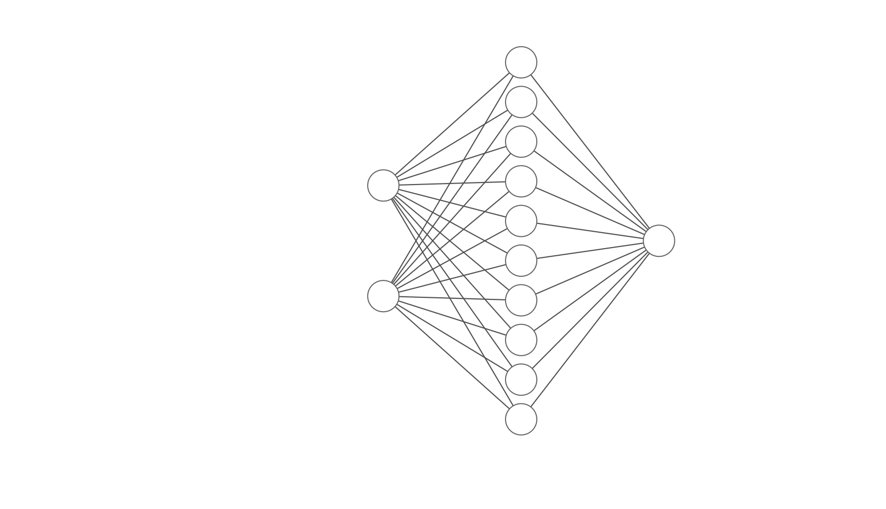

# Foundations of Machine Learing

This repository hosts a variety of machine learning implementations covering a wide range of topics and algorithms. Each algorithm is neatly organized into its own dedicated folder for easy access and navigation.

Before delving into the repository, ensure that you have Python 3 installed on your system. For detailed installation instructions, refer to the [official site](https://www.python.org/downloads/). For a seamless experience, I highly recommend installing Anaconda, a comprehensive Python distribution that includes all the necessary packages for machine learning. This eliminates the need for manual installation of individual packages and ensures a smooth setup process. Currently, I'm utilizing Python **3.11.7**.

To clone the repository, simply execute the following command in your preferred terminal:

```bash

git  clone  https://github.com/asimzz/foundations-of-ml.git

```

Let's explain each section separately:

## Table of Contents

- [Foundations of Machine Learing](#foundations-of-machine-learing)
  - [Table of Contents](#table-of-contents)
  - [Single Neural Network Layer From Scratch](#single-neural-network-layer-from-scratch)
    - [Instructions](#instructions)

## Single Neural Network Layer From Scratch

You can find the corresponding folder in `nn-from-scratch`. Our intention here is to build a neural network from scratch using only a single hidden layer neural network to solve the XOR problem.

The folder structure is divided as follows:

1.  `data.py`

This file includes the generation of random dataset with 800 samples generated randomly using random.random to generate random numbers between [0.0,1.0]

also it includes the splitting of the data into train and test sets.

2.  `activations.py`

It includes all of our activations functions, for this example I'm only using sigmoid function. The sigmoid function is defined as:
$\sigma(x) = \frac{1}{1+e^{-x}}$

and its derivative is given by:
$\sigma^{'}({x}) = \sigma(x) .(1-\sigma(x))$

3.  `evaluations.py`

it contains the choice of our loss functions since we are dealing with classifications problem, I used negative logarithmics function.

$L(\theta) = -\sum_{i=1}^{n} \left( y_i \log(\hat{y}_{\theta,i}) + (1 - y_i) \log(1 - \hat{y}_{\theta,i}) \right)$

4.  `model.py`

In this file, you have the flexibility to define your network architecture, including the number of inputs (h0), hidden units (h1), and outputs (h2). By default, I've set the number of hidden units to 10 for simplicity, but you can adjust it according to your preferences. The architecture is structured as follows:

`2 inputs -> 10 hidden units -> 1 output`. These parameters can be defined within the constructor of the class.



Additionally, the class incorporates four essential methods. Here's a breakdown of the key functionalities provided by each method:

`forward_pass`: Executes the forward pass through the neural network, computing the output layer activations.

`backward_pass`: Performs the backward pass to compute gradients for weight updates during training.

`update`: Updates the weights and biases of the neural network based on the computed gradients and a specified learning rate.

`predict`: Generates predictions using the trained model based on input data.

5.  `main.py`

Serving as the entry point of the program, this script loads the split dataset and feeds it into the model. Subsequently, the training phase commences with a learning rate of 0.1, during which training and test losses are computed at each epoch. Finally, the trained model is evaluated on the test set, and the accuracy of both the training and test sets is printed.\

### Instructions

To execute the code, navigate to the `nn-from-scratch` directory within the cloned repository:

```bash

cd  nn-from-scratch

```

Next, run the `main.py` file, which serves as the entry point, using the following command:

```bash

python3  main.py

```
